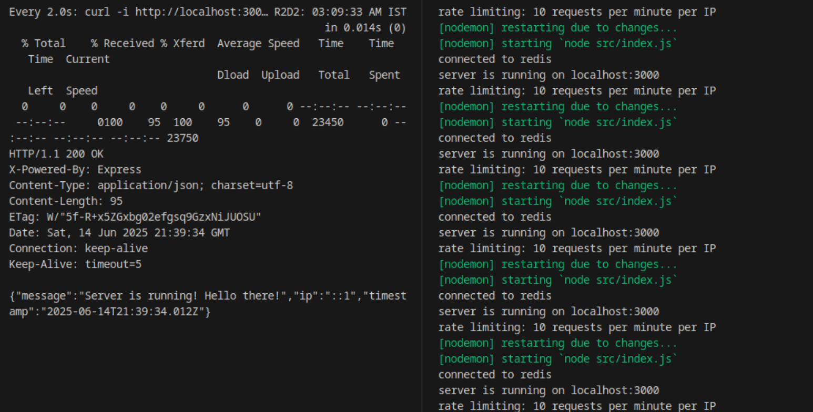
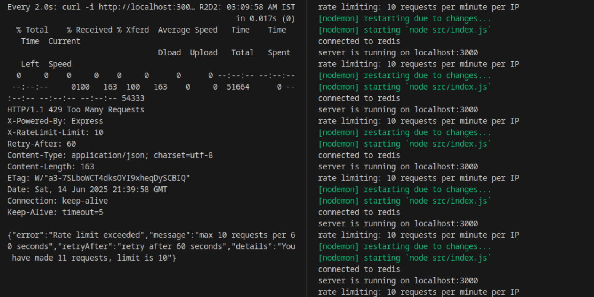

API Rate Limiter

What I built:

A mini API rate limiter that limits requests from a single IP using sliding window logic. Successfully allows max 10 requests per IP per 1 minute with smooth rate limiting.

Tech Stack:

- Node.js with Express (simple and effective for APIs)
- Redis for storing request counts (fast, in-memory)
- JavaScript
- Local Redis setup
- Sliding window algorithm using sorted sets

My Approach - Step by Step:

1. Architecture Planning
   - chose sliding window over fixed window for smooth rate limiting
   - selected Redis sorted sets for efficient timestamp-based queries
   - designed modular structure for maintainability

2. Redis Integration
   - set up Redis client with proper connection handling
   - added automatic cleanup of expired entries

3. Sliding Window Implementation (core logic here)
   - use timestamps as scores in Redis sorted sets
   - remove expired entries before counting current requests
   - add new requests with unique timestamps

4. API Development
   - built Express server with proper middleware structure
   - created test endpoints to demonstrate rate limiting
   - added comprehensive error handling and user-friendly responses

5. Testing and Validation
   - manual testing with watch command for real-time observation
   - verified sliding window behavior across time periods
   - documented results with screenshots

How the Rate Limiter Works:

- Uses Redis sorted sets to store request timestamps per IP
- Automatically removes expired entries older than the time window
- Counts current requests and blocks if limit exceeded
- Adds current request with unique timestamp for tracking
- Returns 429 status with helpful error message
- Includes rate limit headers to guide client behavior

Project Structure:

- src/index.js - main server file with routes and startup logic
- src/config/redis.js - handles all Redis connection and utility functions
- src/middleware/rateLimiter.js - core sliding window rate limiting logic
- src/controllers/apiController.js - handles request/response logic
- src/routes/apiRoutes.js - defines API endpoints and routing
- docs/images/ - documentation assets
- .env - environment variables
- package.json - dependencies and scripts

Available Endpoints:

- GET / - Server status and info
- GET /test - Test endpoint to demo rate limiting  
- Any other route - Returns 404 with available endpoints

How to run:

1. Make sure Redis is running locally (redis-server)
2. npm install
3. npm start (uses nodemon for auto-restart)
4. Server runs on localhost:3000
5. Run `watch "curl -i http://localhost:3000/test"` in another terminal and watch the responses

Testing Rate Limiting:

I tested the rate limiter using the watch command to see real-time behavior:

watch "curl -i http://localhost:3000/"

This command repeatedly hits the endpoint every 2 seconds, showing:
- First 10 requests: Status 200 with rate limit headers
- 11th+ requests: Status 429 "Rate limit exceeded"
- After 60 seconds from first request: Requests allowed again as window slides

Demo Results:

The rate limiter works perfectly as demonstrated in the screenshots. When testing with the watch command, I could see the rate limiting kick in after exactly 10 requests, returning 429 errors with clear retry information. After waiting for the window to reset, requests were allowed again, proving the sliding window mechanism works correctly.

Technical Implementation Details:

Algorithm: Sliding Window with Redis ZSET -- sorted sets 
- Key: rate_limit:{IP_address}
- Score: timestamp in milliseconds  
- Value: unique identifier to prevent duplicates