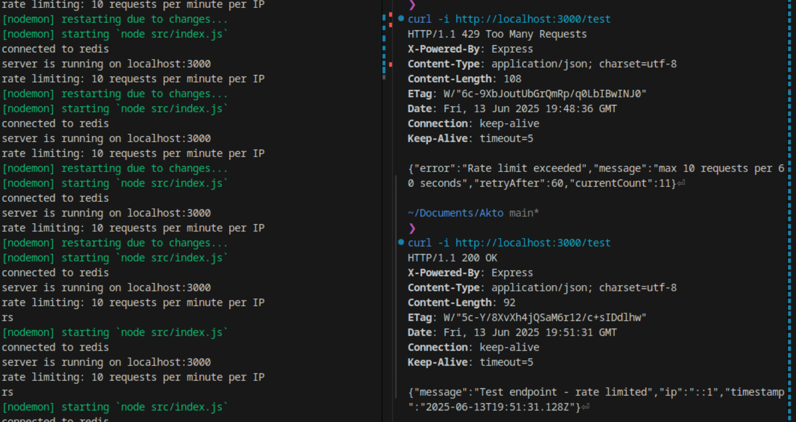

API Rate Limiter

What I built:

- A mini API rate limiter that limits requests from a single IP using sliding window logic. Successfully allows max 10 requests per IP per 1 minute with smooth rate limiting.

Tech Stack:

- Node.js with Express (simple and effective for APIs)
- Redis for storing request counts (fast, in-memory, perfect for rate limiting)
- JavaScript
- Local Redis setup
- Sliding window algorithm

Project Structure:

- src/index.js - main server file with routes and startup logic
- src/config/redis.js - handles all Redis connection and utility functions
- src/middleware/rateLimiter.js - core sliding window rate limiting logic
- docs/images/ - documentation assets
- .env - environment variables (port, redis host/port)
- package.json - dependencies and scripts

My Approach:

1. Set up basic Express server with Redis connection
2. Server connects to Redis first, then starts listening for requests
3. Built sliding window rate limiter with timestamps
4. Implemented proper error handling
5. Organized code in modular structure for maintainability

How the Rate Limiter Works:

- Uses Redis sorted sets to store request timestamps per IP
- Automatically removes expired entries older than the time window
- Counts current requests and blocks if limit exceeded
- Adds current request with timestamp for tracking
- Returns 429 status with helpful error message when limit hit

Available Endpoints:

- GET / - Server status and info
- GET /test - Test endpoint to demo rate limiting
- Any other route - Returns 404 with available endpoints

How to run:

1. Make sure Redis is running locally (redis-server)
2. npm install
3. npm start (uses nodemon for auto-restart)
4. Server runs on localhost:3000

Testing Rate Limiting:

Quick test: curl -i http://localhost:3000/test
(First 10 requests will succeed, 11th+ will get 429 rate limited)

Current Status:
✓ Basic server setup complete
✓ Redis connection working
✓ Environment configuration done
✓ Project structure organized
✓ Sliding window rate limiter implemented
✓ Rate limiting middleware working perfectly
✓ Clean, modular code architecture

Demo Image

- here I get rate limited and again request after 3 minutes

  

Key Features:

- Smooth sliding window
- Automatic cleanup of old entries
- Accurate IP detection with proxy support
- Helpful rate limit headers for clients
- Memory efficient with Redis TTL
